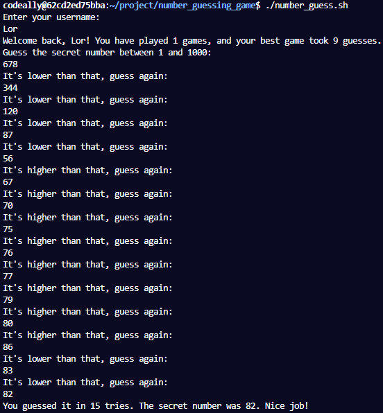
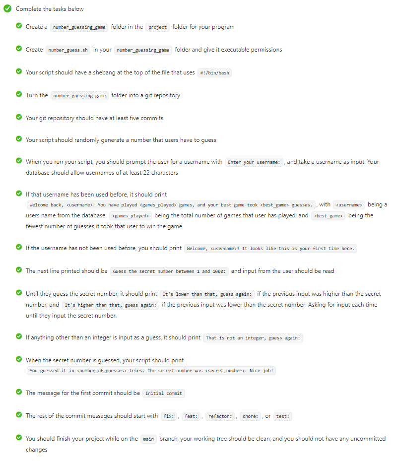

# Number Guess

- This shell script implements a Number Guessing game and saves user progress to a PostgreSQL database.

Technologies used: PostgreSQL, Shell Script

# Live Version Output

# Requirements

